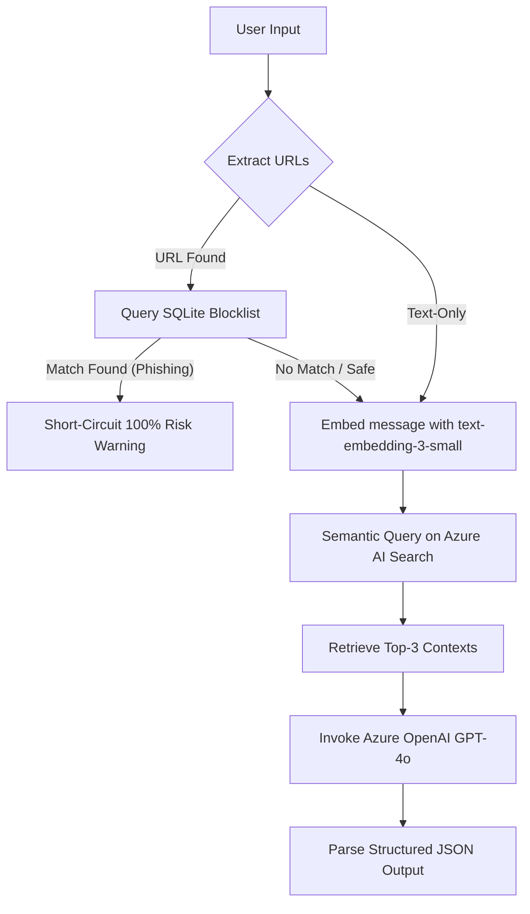

# Jagain — Multilingual Anti-Scam Shield

Jagain is a high-performance, multilingual anti-scam chatbot designed to analyze incoming text messages, SMS, emails, and links to detect scams and phishing threats. It combines a local high-speed SQLite database blocklist with vector-based semantic search (RAG) powered by Azure OpenAI and Azure AI Search.

---

## Key Features

1. **Sequential Screening Pipeline**: Reduces latency and API costs by checking links locally before calling cloud AI.
2. **Local SQLite Blocklist**: Instantly cross-checks URLs against a local database containing over 100MB of processed phishing domains.
3. **Azure AI Search RAG**: Vector-embeds user queries to find similar spam indicators in historical scam datasets (SMS Spam Collection).
4. **Azure OpenAI GPT-4o Integration**: Summarizes risks, highlights security indicators, and generates localized advice.
5. **Dual-Language Guardrails**: Language detection dynamically returns risk explanations and safety recommendations in either **Bahasa Indonesia** or **English**.
6. **Premium Glassmorphic Chat UI**: Built with modern vanilla HTML/CSS/JS features such as vibrant status badges, responsive risk meters, and tag clouds.

---

## Architecture & Flow



---

## Prerequisites & Setup

Ensure you have **Python 3.10+** installed.

### 1. Installation
Clone the repository, initialize your virtual environment, and install dependencies:
```powershell
python -m venv .venv
.venv\Scripts\Activate.ps1
pip install -r requirements.txt
```

### 2. Environment Configuration
Create a `.env` file in the root directory:
```env
AZURE_OPENAI_API_KEY=your-openai-api-key
AZURE_OPENAI_ENDPOINT=https://your-resource.cognitiveservices.azure.com/
AZURE_OPENAI_DEPLOYMENT_CHAT=gpt-4o
AZURE_OPENAI_DEPLOYMENT_EMBED=text-embedding-3-small
AZURE_OPENAI_API_VERSION=2024-02-01
AZURE_SEARCH_ENDPOINT=https://your-search-service.search.windows.net
AZURE_SEARCH_API_KEY=your-search-admin-key
AZURE_SEARCH_INDEX=sms-scams-index
```
> **Note:** Ensure local authentication is enabled on your Azure Search Service. If disabled, run:
> `az search service update --name <service-name> --resource-group <rg-name> --set disableLocalAuth=false`

---

## Database Ingestion & RAG Setup

1. **Preprocess URL Blocklist** (Creates local SQLite database `scam_urls.db`):
   ```powershell
   python scripts/preprocess_urls.py
   ```
2. **Ingest SMS Dataset into Azure Search** (Embeds and uploads reference spam data):
   ```powershell
   python scripts/ingest_sms_rag.py
   ```

---

## Verification & Running

### Run the Test Suite
To execute the mock unit and connection tests:
```powershell
python -m pytest -v
```

### Start the FastAPI Web Server
Run the backend web server with hot-reload enabled:
```powershell
python -m uvicorn backend.main:app --port 8000 --reload
```
Once started:
- Access the web interface at: **`http://127.0.0.1:8000`**
- Interactive Swagger API docs are available at: **`http://127.0.0.1:8000/docs`**

---

## Directory Structure

```text
├── backend/
│   ├── database.py       # Local SQLite blocklist query matching
│   ├── detector.py       # Core anti-scam classification and RAG orchestrator
│   └── main.py           # FastAPI server routing and static file mounting
├── frontend/
│   ├── index.html        # HTML layout of the chat interface
│   ├── index.css         # Dark glassmorphic design system stylesheets
│   └── index.js          # Chat handlers and API fetch controllers
├── scripts/
│   ├── preprocess_urls.py # Prepares scam URL database from raw datasets
│   ├── ingest_sms_rag.py  # Populates the Azure AI Search index
│   └── test_connections.py# Validates live connections to Azure OpenAI and Search
├── tests/                # Test suites covering API, DB, detector, and setup
└── requirements.txt      # Project requirements
```
